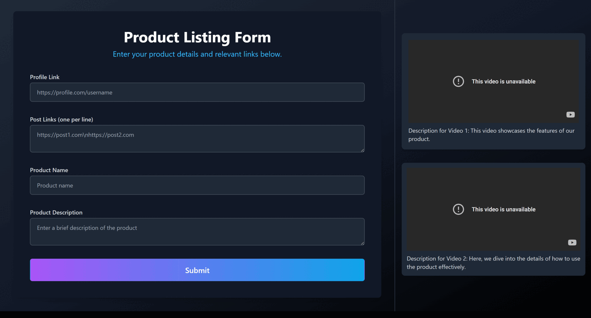

# Template
1. A vite_react frontend (additional landing page)
2. A flask integrated python backend
3. A template for CrewAI agents
4. An express server

## How to Run the App
1. Double click on startapp in windows only.

### Gallery:

### Your .env in the root folder will have the following keys: 
VITE_GEMINI_API_KEY=
VITE_MODEL=

 

